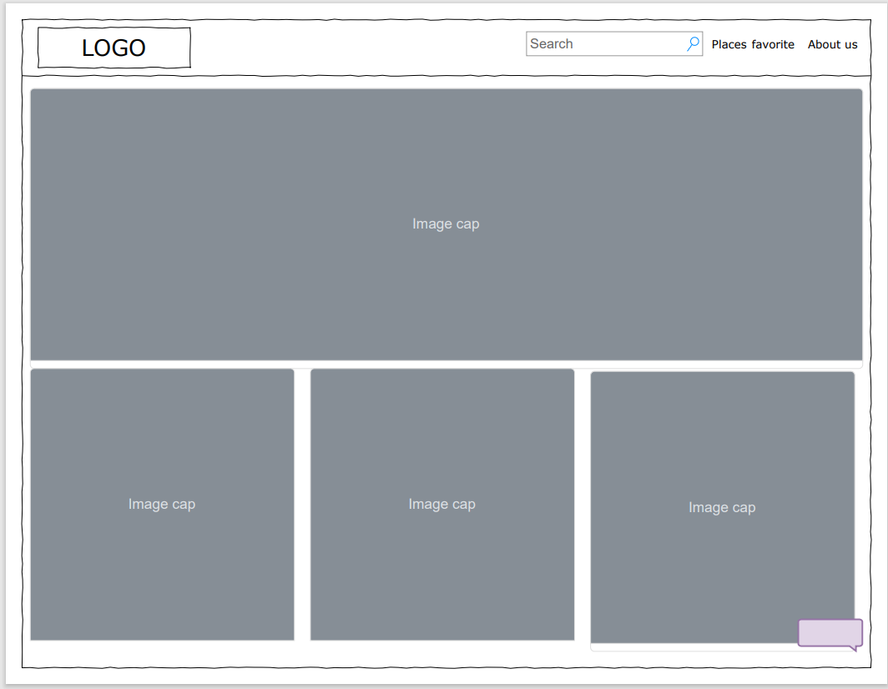
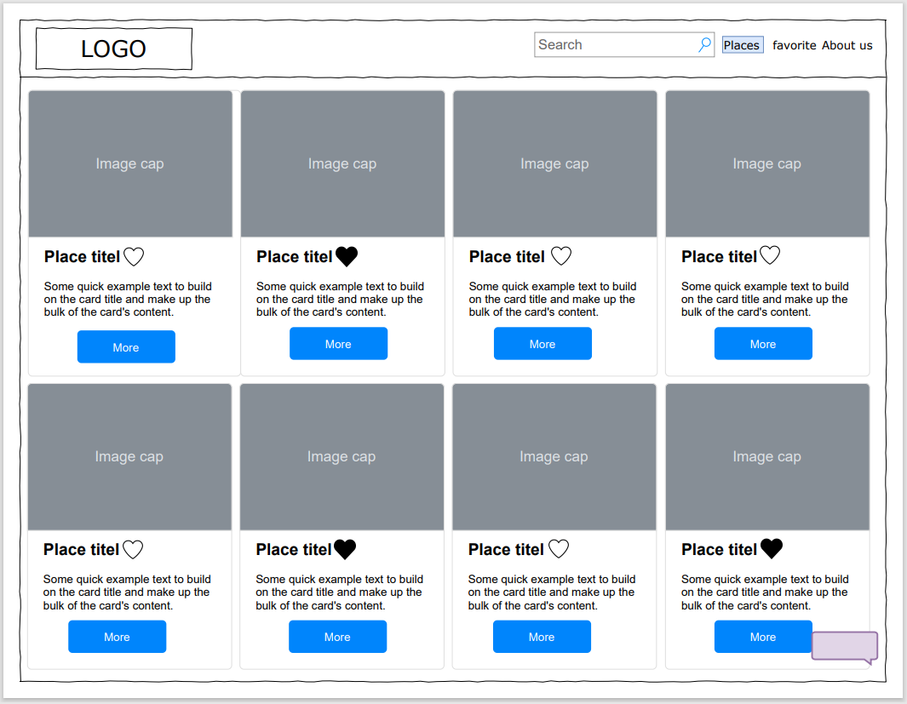
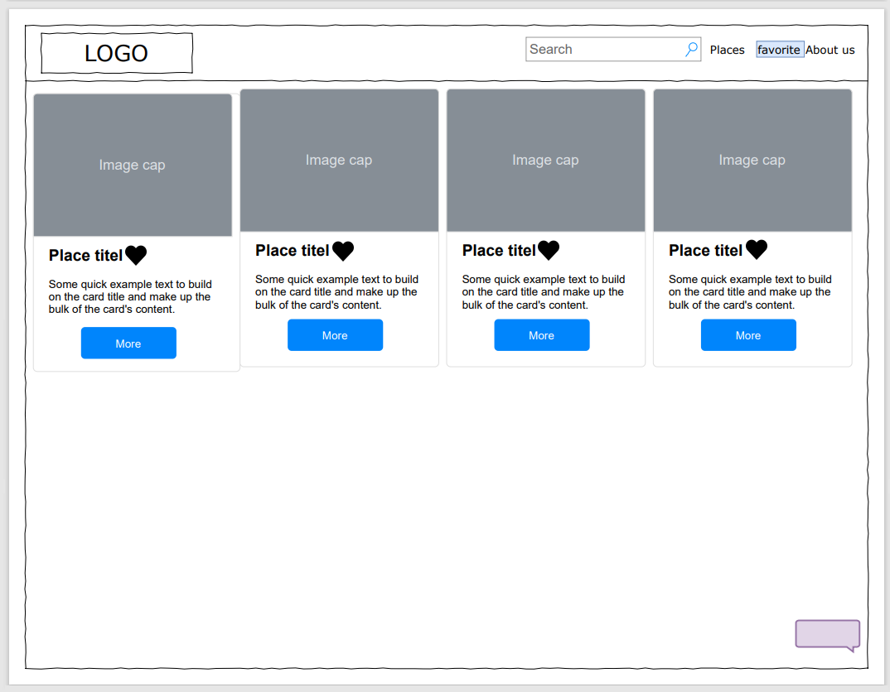

#   Places Finder
## :round_pushpin: Introduction
Places Finder is a Single-Page-Applications that shows you a list of the nearest tourist, shopping, or restaurants places. You can view the venue details. You can search for places by name or prefer the place to visit later. All of this is done by relying on <a href= 'https://developers.google.com/places/web-service/overview'> Google Places API. </a> 

### :dart: Getting Started
### :pencil: Wireframe
Started the app by designing its layout framework by <a href= 'https://app.diagrams.net/'>Draw.io</a>. This app has 3 main Components as the following:

- The Home Component:
Shows places list that user can navigate.

- The Places Component:
Will render a list of places with its information depending on what kind of place the user selected.

- The Favorite Component:
Will render a list of the user favorite places have added there before with its information. And can delete the list.

### :bulb: Technologies Used.
* HTML
* CSS
* JavaScript (ES6)
* Bootstrap
* Reacte js
* <a href= 'https://developers.google.com/places/web-service/overview'>Google Places API</a> 
* <a href= 'https://unsplash.com/developers'>Unsplash</a> 
* Postman 

### :sunglasses: User Stories
* As a user, I should be able to navigate between components.
* As a user, I should be able to search for a specific place by name.
* As a user, I should be able to view the place information.
* As a user, I should be able to add places to my favorite list.
* As a user, I should be able to delete places to my favorite list.

## :mag: App Preview

### :link: Links
* Live - <a href='https://pages.git.generalassemb.ly/fatmahhelal/Second-Project/'/> Places Finder </a>
* Github - <a href='https://git.generalassemb.ly/fatmahhelal/Second-Project'> Here </a>

### :sparkles:Future Features:
- Register and Login User
- Add Comment on Places
- Rating Places
